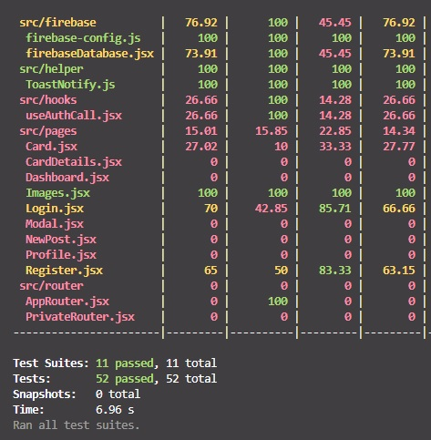

# FireBlog app via Firebase Data Base and authentication additional with API and React Testing Library

## Description

Project aims to create a FireBlog App via FireBase Real Time Data Base and authentication. In addition, an api (https://restcountries.com/v3.1/all) including data of countries integrated to the project. Country datas fetched, configured and sent to the Firebase Realtime Database. Also the project contains like and comment button. The like button will increase the liked number and comment button add the comment to the list of comments.  All CRUD implementations are used on this project.

## Project Skeleton

```
- FireBlogg app  (folder)
|
|----readme.md         
SOLUTION
|
├── public
│     └── index.html
├── src
│    ├── app
│    │     └── __test__
│    │     └── store.jsx
│    |── assets
│    ├── features
│    │     ├── __test__
│    │     └── authSlice.jsx
│    ├── firebase
|    |     ├── __test__
|    |     ├── firebase-config
│    │     └── firebaseDatabase.jsx
│    ├── helper
|    |     ├── __test__
|    |     └── ToastNotify.jsx
│    ├── hooks
|    |     ├── __test__
|    |     └── useauthCall.jsx
│    ├── pages
|    |     ├── __test__
|    |     ├── Card.jsx
|    |     ├── CardDetails.jsx
|    |     ├── Dashboard.jsx
|    |     ├── Images.jsx
|    |     ├── Login.jsx
|    |     ├── Modal.jsx
|    |     ├── NewPost.jsx
|    |     ├── Profile.jsx
|    |     └── Register.jsx
│    ├── Router
|    |     ├── AppRouter.jsx
|    |     └── PrivateRouter.jsx
│    ├── App.css
│    ├── index.js
│    └── index.css
├── package.json
├── .env
└── yarn.lock
```

## Objective

Project aims to create a FireBlog App via FireBase Real Time Data Base and authentication. In addition, an api (https://restcountries.com/v3.1/all) including data of countries integrated to the project. Country datas fetched, configured and sent to the Firebase Realtime Database. Also the project contains like and comment button. The like button will increase the liked number and comment button add the comment to the list of comments.  All CRUD implementations are used on this project. Finally, in order to improve testing capabilities, some test implementations added to the components, test result is as follows;

## 🖥️Desktop version (ADD operations on todo app-left side shows server)
<br>

<br>
<br>
<br>
<br>
<br>
<br>
<br>
<br>
<br>
<br><br><br><br><br><br><br><br><br>

### At the end of the project, following topics are to be covered;

- HTML

- CSS

- JS

- React

- React Testing Library

- .env file

- CRUD operations with React and Fire Base Real Time Data Base.

- API get operation.

- Data base get, update, write, delete operations.

- Toastify

- Bootstrap

- Material UI

- Styled Component


### At the end of the project;

- improve coding skills within HTML & CSS & JS & React & React Testing Library & API get, update, write and delete operations & Bootstrap. useEffect, useState, react-router, useLocation, useNavigate hooks used in this project  hooks used in this project.

- use git commands (push, pull, commit, add etc.) and Github as Version Control System.

🔗 <b>To see the live version https://fireblog-apps.netlify.app/<b> 


**<p align="center">&#9786; Happy Coding &#9997;</p>**

<br><br>
🌐 The desktop and mobile versions of the web page are as follows;🧭
<br><br>

## 🖥️Desktop version (ADD operations on todo app-left side shows server)
<br>

<br>
<br>
<br>
<br>
<br>
<br>
<br>
<br>
<br>
<br><br><br><br><br><br><br><br><br>


## 📱Mobile version
<br>

<br>
<br>
<br>
<br>
<br>
<br>
<br>
<br>
<br>
<br><br><br><br><br><br><br><br><br>


